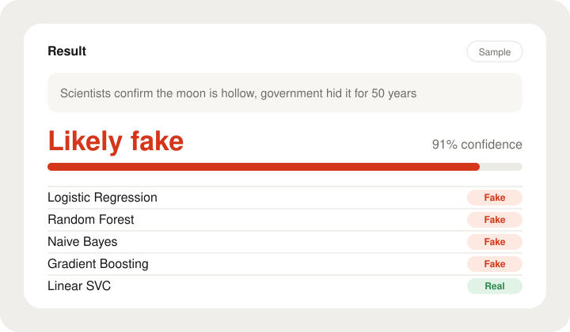
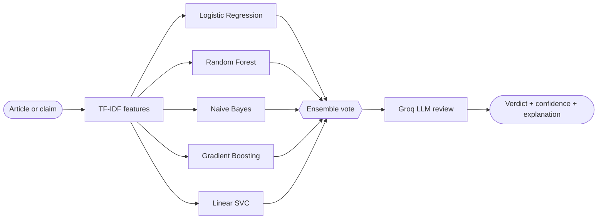

<div align="center">


<br>

[](https://credible2-0.onrender.com/)


[Live demo](https://credible2-0.onrender.com/) &nbsp;|&nbsp; [Overview](#overview) &nbsp;|&nbsp; [How it works](#how-it-works) &nbsp;|&nbsp; [Features](#features) &nbsp;|&nbsp; [Quick start](#quick-start) &nbsp;|&nbsp; [Deployment](#deployment-notes) &nbsp;|&nbsp; [Roadmap](#roadmap)

</div>

---

## Overview

Fake news spreads faster than corrections. Most detectors are either one model that is easy to fool, or an LLM call with nothing behind it.

**Credible uses both.** Five classic ML classifiers give a fast, consistent baseline. A Groq-hosted LLM then reviews the text and explains, in plain English, what looks reliable or suspicious.

**Try it live:** [https://credible2-0.onrender.com/](https://credible2-0.onrender.com/)

<div align="center">

<br>
<sub>Sample output. Verdict, confidence, and how each model voted.</sub>
</div>

## How it works



1. **ML ensemble.** The text becomes TF-IDF features. Five classifiers each vote real or fake, and the ensemble combines them into one verdict with a confidence score.
2. **LLM review.** The text and the ensemble result go to an LLM on the Groq API, which adds a second opinion and a short written explanation.

## Features

| | |
|---|---|
| **Five-model ensemble**<br>One weak model can't decide the result. | **Confidence score**<br>A clear percentage, not just a label. |
| **Per-model breakdown**<br>See where the models agree and disagree. | **LLM second opinion**<br>A readable explanation, powered by Groq. |
| **Pre-trained model**<br>Loads at startup. No retraining on launch. | **Fast on cold data**<br>TF-IDF plus linear models keep inference light. |

### The model lineup

| Model | Family | What it brings |
|---|---|---|
| Logistic Regression | Linear | Strong, interpretable baseline on TF-IDF |
| Random Forest | Tree ensemble | Catches non-linear patterns |
| Naive Bayes | Probabilistic | Fast, works well on word counts |
| Gradient Boosting | Boosted trees | Learns from earlier models' mistakes |
| Linear SVC | Margin-based | Good separation on high-dimensional text |

## Tech stack

| Area | Tools |
|---|---|
| Language | Python 3.8+ |
| Machine learning | scikit-learn, TF-IDF |
| LLM inference | [Groq API](https://groq.com/) |
| Web app | Streamlit |
| Dataset | WELFake, about 72,000 labelled articles |
| Hosting | Render (app), Hugging Face (dataset and model file) |

## Quick start

**You need:** Python 3.8+ and a free [Groq API key](https://console.groq.com/).

```bash
git clone https://github.com/DevendraChoudhary1005/credible.git
cd credible
python -m venv venv
source venv/bin/activate        # Windows: venv\Scripts\activate
pip install -r requirements.txt
```

Create a `.env` file in the project root:

```env
GROQ_API_KEY=your_groq_api_key_here
```

Run it:

```bash
streamlit run app.py
```

Open http://localhost:8501. On the first run the app downloads the pre-trained model and dataset from Hugging Face. This happens once.

> `.env` is in `.gitignore`. Never commit your API key.

## Deployment notes

<details>
<summary><b>What I ran into on a free hosting tier, and what I did about it</b></summary>

<br>

| Problem | Fix |
|---|---|
| Training five classifiers on ~72K articles at startup ran out of memory and crashed the app | Train offline, save the ensemble, load the saved file at startup |
| Google Drive links hit download quotas and returned HTML pages instead of files | Moved the dataset and model file to Hugging Face for stable direct downloads |
| A saved model can break when loaded with a different scikit-learn version | Pinned the scikit-learn version in `requirements.txt` |

The live demo runs on a free tier, so the first load after inactivity can take about a minute.

</details>

## Limitations

<details>
<summary><b>Read before relying on a result</b></summary>

<br>

- Credible is a screening tool, not a source of truth. It can be wrong, especially on satire, breaking news, or topics that are rare in the training data.
- The ML models learn wording patterns from WELFake, so they may do worse on other writing styles or languages.
- The LLM explanation is generated text. Check anything important against a trusted source.

</details>

## Roadmap

- [x] Five-model ensemble with confidence score
- [x] LLM second opinion via Groq
- [x] Deployed live on Render
- [ ] Show accuracy, precision, recall, and F1 per model in the app
- [ ] Add source links to the LLM explanation
- [ ] Expose the pipeline as a REST API for browser extensions and bots
- [ ] Multi-language support

---

<div align="center">

**Built by Devendra Choudhary**
B.Tech CSE (AI & ML), JECRC University, Jaipur

[Live demo](https://credible2-0.onrender.com/) &nbsp;|&nbsp; [GitHub](https://github.com/DevendraChoudhary1005) &nbsp;|&nbsp; [LinkedIn](https://linkedin.com/in/devendra-choudhary-dc101005) &nbsp;|&nbsp; [Email](mailto:dchoudhary10102005@gmail.com)

</div>

[GitHub](https://github.com/DevendraChoudhary1005) &nbsp;|&nbsp; [LinkedIn](https://linkedin.com/in/devendra-choudhary-dc101005) &nbsp;|&nbsp; [Email](mailto:dchoudhary10102005@gmail.com)

</div>
